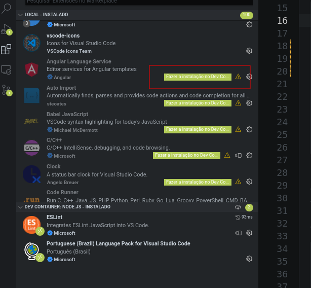

# Usando VSCode no Docker

Plugins necessários:

- [Docker](https://marketplace.visualstudio.com/items?itemName=ms-azuretools.vscode-docker);  
  `ext install ms-azuretools.vscode-docker`

- [Remote Development](https://marketplace.visualstudio.com/items?itemName=ms-vscode-remote.vscode-remote-extensionpack);  
  `ext install ms-vscode-remote.vscode-remote-extensionpack`

- [Remote - Containers](https://marketplace.visualstudio.com/items?itemName=ms-vscode-remote.remote-containers);  
  `ext install ms-vscode-remote.remote-containers`

- [Remote - SSH](https://marketplace.visualstudio.com/items?itemName=ms-vscode-remote.remote-ssh);  
  `ext install ms-vscode-remote.remote-ssh`

Caso use [WSL](https://docs.microsoft.com/en-us/windows/wsl/):

- [Remote - WSL](https://marketplace.visualstudio.com/items?itemName=ms-vscode-remote.remote-wsl);  
  `ext install ms-vscode-remote.remote-wsl`

Quando instalado o Remote Development irá instalar os outros 3 plugins (Remote Containers, Remote SSH e Remote WSL).

O Remote Container permite rodar o VSCode dentro de um container, ele irá habilitar uma barra de status nova no lado esquerdo e ao clicar nela, o VSCode irá mostrar os comandos do plugin.

As opções do plugin são:

1. Open Folder in Container (Abrir Pasta no Container);  
  Esta opção irá abrir uma pasta que contém arquivos Docker em um container.

2. Attach to Running Container (Anexar ao Contêiner em Execução);  
  Esta opção anexa a janela atual em um container já aberto.

3. Try Sample (Testar um exemplo);  
   Esta opção inicia os exemplos do plugin sobre.

O plugin utilizar de arquivos dentro de uma pasta `.devcontainer`, o arquivo mais importante é o `devcontainer.json`, que é um arquivo de configuração.

Ao iniciar o desenvolvimento remoto, primeiro, é criada uma imagem a partir de um arquivo ou a partir de um nome de imagem. 
Em seguida é criado um contêiner e só então o ambiente do VSCode é instalado e configurado, de acordo com o arquivo `devcontainer.json`.

## Configurações Adicionais

Algumas configurações que podem ser colocadas no arquivo `.devcontainer.json`.

* `"customizations"`: É um objeto, recebe algumas customizações a serem aplicadas.
* `"vscode"`: Vai dentro de `"customizations"` recebe as configurações a serem usadas pelo VSCode.
* `"extensions'`: Vai dentro de `"customitions"`, recebe uma lista dos IDs de plugins a serem instalados no container quando criado.
* `"fowardPorts"`: Lista de portas do containers que serão expostas do container.
* `"postCreateCommand"`: Comandos a serem executados que serão executados depois que o container for criado, em formado de String. Ex.: `"npm install --production"`.
* `"remoteUser"`: É o nome de usuário que o VS Code irá utilizar dentro do container.
* `"service"`: Nome do serviço onde o VSCode deve contectar quando rodar.
* `"features"`: Aqui é possível passar um objeto contendo as features e as versões a serem adicionadas no container. [Clique aqui](https://code.visualstudio.com/docs/remote/containers#_dev-container-features-preview).

Documentação completa do [`devcontainer.json`](https://code.visualstudio.com/docs/remote/devcontainerjson-reference)

Se vc gosta de usar um Shell diferente do [BASH](https://pt.wikipedia.org/wiki/Bash) como padrão provavelmente vai ter um problema, caso não tenha configurado seu Dockerfile para instalar seu Shell favorito, o VSCode não vai conseguir abrir um shell novo.  
Para não ter problemas com isso, basta fazer a seguinte configuração:

```json
{
  // (...)
  "customisations": {
    "vscode": {
      "settings": {
        "terminal.integrated.defaultProfile.linux": "bash"
      }
    }
  }
  // (...)
}
```

Essa configuração irá abrir o [BASH](https://pt.wikipedia.org/wiki/Bash) no terminal integrado por padrão.

É possível também configurar uma pasta do container como workspace.  

```json
{
  // (...)
  "workspaceFolder": "/home/node/app"
  // (...)
}
```

## Plugins do VSCode

Alguns plugins precisam estar instalados localmente, dentro do container. Para isso podemos passar uma lista de plugins que podem ser instalados no container quando criado.

```json
{
  // (...)
  "customizations": {
    "extensions": [
      "humao.rest-client",
      "formulahendry.auto-rename-tag",
      "dbaeumer.vscode-eslint",
      "eg2.vscode-npm-script",
      "christian-kohler.npm-intellisense",
      "esbenp.prettier-vscode",
      "rvest.vs-code-prettier-eslint",
      "mohsen1.prettify-json",
      "johnpapa.vscode-peacoc",
      "gruntfuggly.todo-tree",
      "andys8.jest-snippets",
      "ms-azuretools.vscode-docker"
    ]
  }
  // (...)
}
```

O VSCode vai comparar os plugins instalados e vai indicar quais plugins que estão fora do container devem ser instalados dentro do container e oferecer a opção de instalar o plugin no contaner.



# Caso de uso

## Abrir pasta 
